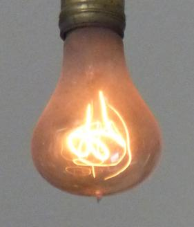

## Les ampoules
Au début des années 1900, la longévité des ampoules ne cessaient de s'accroître, mais c'était un problème pour les entreprises qui faisaient des ampoules, parce que les gens n'avait pas à acheter des ampoules régulièrement. C'est pourquoi ces entreprises ont décidés de réduire la durée de vie des ampoules de 2500h à 1000h. C'est la naissance de l'obsolescence programmée. La preuve, il existe une ampoule dans la caserne de Livermore en Californie qui brille depuis plus de 115 ans (voir image ci-dessous).

## Les bas de nylon
Au début, les bas de nylon était très résistant, mais il était trop résistant pour que ce soit rentable pour les compagnies qui les fabriquaient, car les bas de nylon n'avait pas besoin d'être changer régulièrement. C'est pourquoi les équipes d'ingénieur qui ont conçus le bas de nylon original ont du revoir la formule afin de la rendre plus fragile

## La mode et la Ford T
Dans les années 1920, la Ford T domine le marché de l'automobile avec ce véhicule durable produit depuis déjà 10 ans à cette époque. C'est alors que General Motors, un compétiteur de Ford, a créé une nouvelle manière de vendre ses véhicules, cette compagnie a commencé à présenter à chaque année un nouveau modèle afin de démoder ceux des années passées afin de donner le goût au consommateur de racheter plus rapidement une voiture en disant que les vieilles, même si elle marchait toujours, n'était plus à la mode.

## Les ipods et les batteries
En 2003, les premiers ipods avaient des batteries conçues pour durer à peu près un an, puis se dégrader complètement. En plus, la batterie n'était pas remplaçable. Ce qui obligeait ceux qui avaient ces ipods à les changer souvent. Ce qui a mené à un recours collectif contre Apple qui a terminé par la mise en place d'un service après vente et une garantie de 2 ans.

## Les iphones et les mises à jours
Les iphones 6, 6S et 7 ont reçu des mises à jours qui les ont ralenti et l'affaire est allé devant les tribunaux. Apple a fini par avouer qu'il ralentissait ces iphones, pour améliorer les capacités de leurs vielles batteries. Maintenant, il y a une option pour désactiver cette économie d'énergie et retrouver les performances, par contre il est recommandé de remplacer la batterie.
