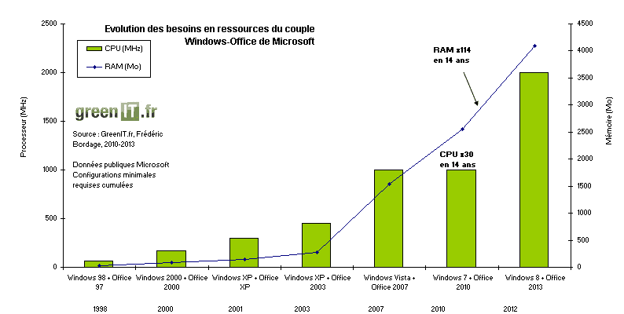

## Comment ça marche
Pour faire simple, plus un ordinateur est récent, plus il va être puissant à quelques exceptions près. Le problème c'est que même si les ordinateurs sont toujours plus puissants, ils ne sont pas plus rapide, car les programmeurs qui codent les programmes n'ont plus des ressources limitées qui les forcent à rendre leurs programmes légers et peuvent ajouter des fonctionnalités la majorité du temps inutiles qui alourdissent leurs programmes ce qui ralentit les vieux ordinateurs avec les mises à jours de ces programmes.

## Windows et Office (Word et cie)
Windows et Office sont d'excellents exemples d'obsolescence logicielle puisqu'ils existent depuis longtemps et ont eu de nombreuses mises à jours. Voici un petit graphique qui montre les configurations minimales nécessaire pour utiliser Word sur Windows.

