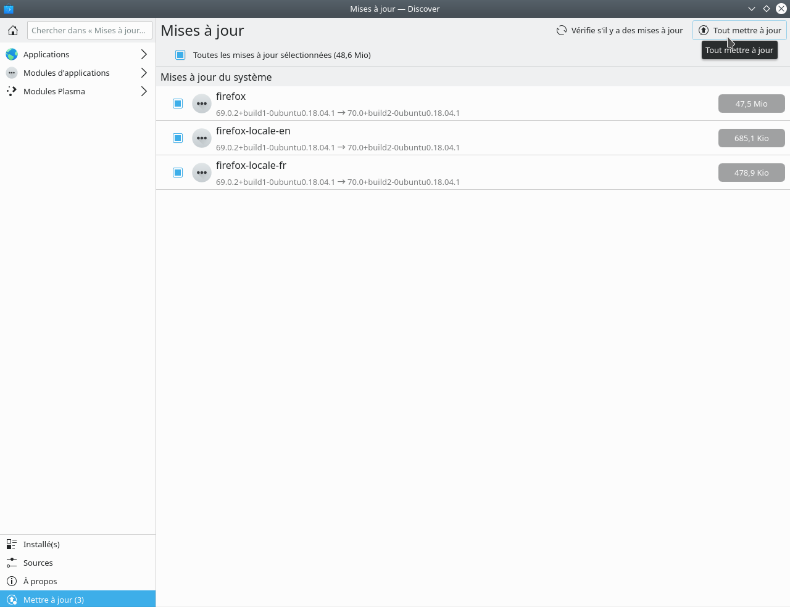

## Mettre à jour
1. Cliquer sur _Mettre à jour_ lorsque vous recevez la notification de mise à jour. Sinon, vous pouvez cliquer sur l'icône qui apparaît lorsqu'une mise à jour est disponible.
2. Appuyer sur le bouton _Tout mettre à jour_ dans la fenêtre qui vient d'apparaître.

!> Les mises à jour sont manuelles, c'est-à-dire que c'est vous qui devez les faire dès que vous voyez la petite icône.

## Accélérer le système

!> Ces manipulations ne sont pas nécessaire si votre système n'a pas de misère avec les animations.
1. Ouvrir l'application _Configuration du système_.
2. Aller dans la section **Espace de travail** > **Comportement de l'espace de travail** > **Compositeur**
3. Décocher toutes les animations.
4. Aller dans la section **Matériel** > **Affichage et Écran** > **Compositeur**.
5. Mettre la vitesse d'animation à Ultra-Rapide.
