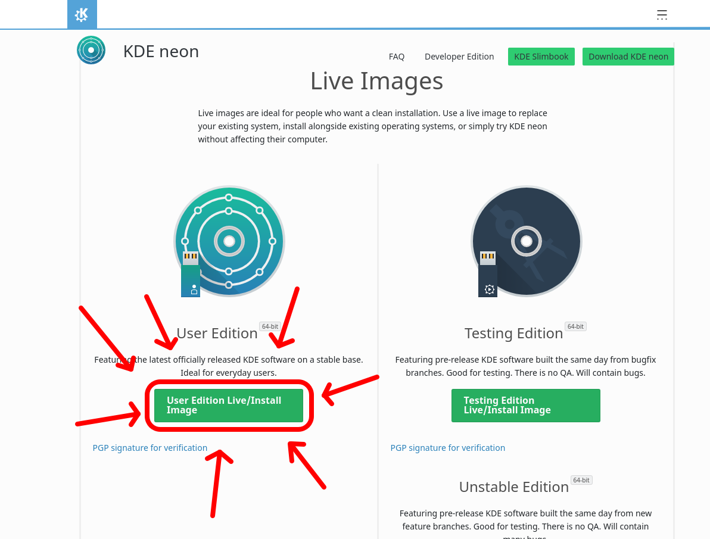
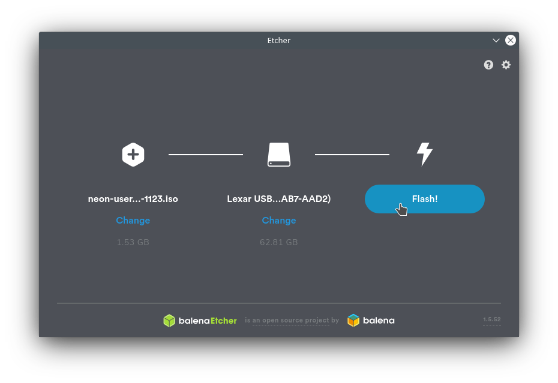
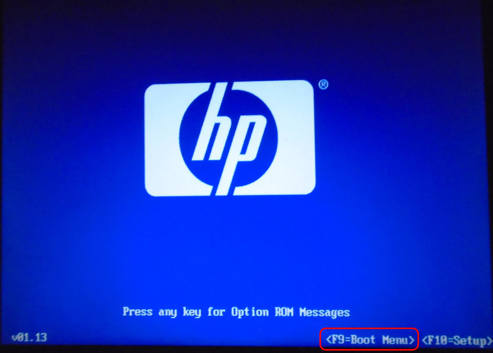

## Prérequis
- Un ordinateur.
- Une clé USB ou une carte SD ayant une capacité de 2G et +.
- Un accès à internet

## Créer une clé USB d'installation
1. Télécharger l'édition _User_ de KDE Neon sur [le site officiel](https://neon.kde.org/download). (Environ 1.5GB)

2. Installer le logiciel [Etcher](https://www.balena.io/etcher/).

!> Faites attention l'étape 3 va effacer toutes les données sur la clé USB.

3. Utiliser Etcher pour créer une clé USB d'installation.

## Démarrer à partir de cette clé
4. Brancher la clé USB d'installation dans l'ordinateur auquel vous voulez donner une seconde vie.
5. Redémarrer l'ordinateur et lors du démarrage repérer la touche pour le **boot menu** lorsque vous voyez le logo en plein écran de la marque de votre ordinateur. (Elle varie d'un ordinateur à l'autre) Si vous ne la trouvez pas voici [une liste des touches](https://pc83.fr/tools/liste-bios-key-boot-menu-key.html).

6. Appuyer sur cette touche et vous verrez un menu avec les différents choix de démarrage, sélectionner la clé USB avec les flèches du clavier et appuyer sur la touche enter.

## Le test
Une fois que KDE Neon est démarré, vous pourrez tester sans risquer d'effacer vos données le système. Lorsque vous exécutez KDE Neon à partir de la clé USB et que tout fonctionne correctement, il est sûr à 99% que l'installation va marcher du premier coup.

## L'installation
À partir de ce moment, vous n'avez qu'à cliquer sur l'icône _Install KDE Neon_ et à suivre les étapes de l'installateur. Lorsque vous arriverez à la section disque sachez que l'option par défaut va remplacer votre système d'exploitation précédent, donc tout effacer.
