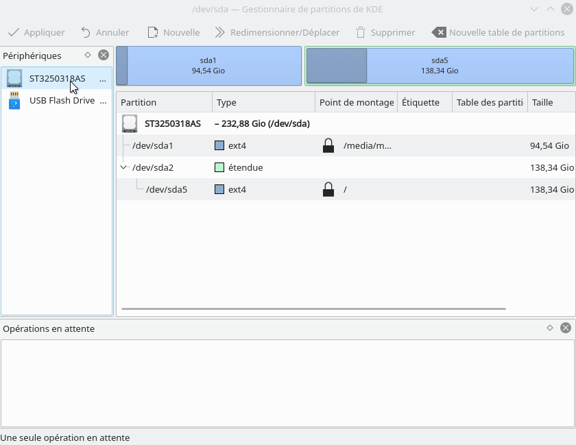

## Prérequis  
Pour récupérer votre clé USB, il vous faudra installer un logiciel de partition. Pour l'installer sous Linux, il vous suffit d'ouvrir le programme _Konsole_ et d'entrer les lignes de codes ci-dessous.  
```bash
sudo apt install partitionmanager -y
```
## Étapes à suivre  
1. Ouvrir le logiciel gestionnaires de partition de kde, votre mot de passe sera demandé.
2. Effectuer les manipulations comme dans l'image ci-dessous.

!>  Si vous voyez un petit cadenas a côté , c'est que vous devez faire un clic droit sur la partition et sélectionner l'item *libérer* avant de supprimer.





!>  Un bug étrange affecte Windows le rendant incapable de détecter les clés USB vides. Pour le contourner, vous devez simplement créer un fichier sur votre clé USB.

## En savoir plus
Cette technique pour récupérer votre clé USB peut marcher avec des clés USB corrompue (Comme celles qui ne sont plus détectées par Windows après avoir été branché dans un Mac).
