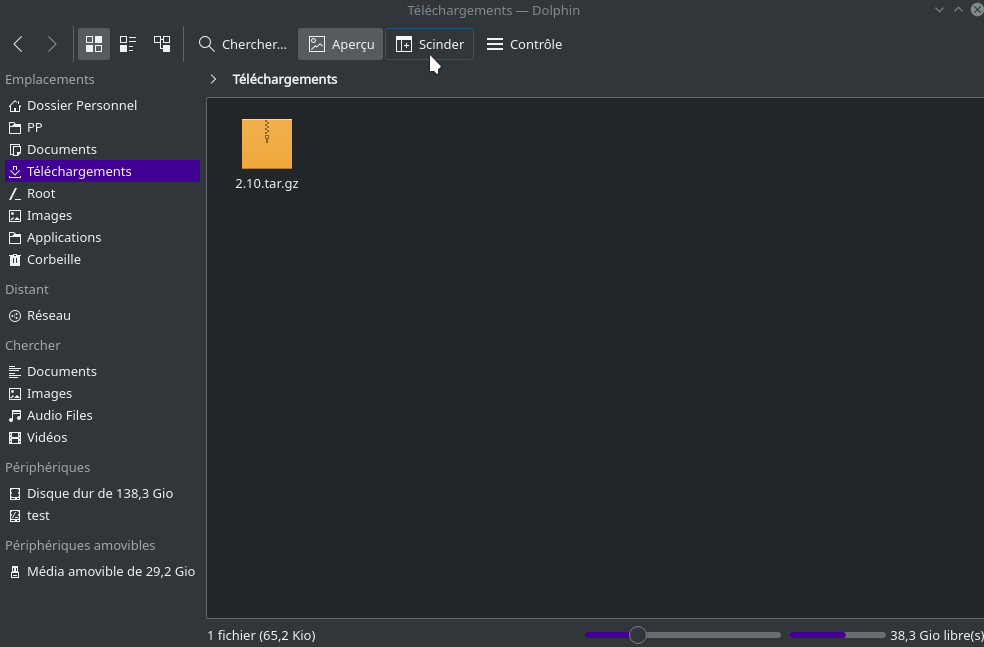

## Introduction
Ce petit guide sur GIMP n'est pas pour apprendre le photomontage, il est orienté vers des personnes ayant déjà utilisé Photoshop et qui veulent adapter GIMP pour le rendre un peu plus comme Photoshop en changeant légèrement l'interface et les raccourcis clavier.

## Installer GIMP
1. Ouvrer l'application _Konsole_.
2. Copier cette commande et coller dans l'application (ctrl-shift-v) _Konsole_ et appuyer sur la touche ENTER.
``` bash
sudo add-apt-repository ppa:otto-kesselgulasch/gimp -y && sudo pkcon refresh && sudo apt install gimp
```

## Bon à savoir
GIMP peut lire et modifier les fichiers Photoshop (.psd), mais il est préférable d'utiliser le format natif de GIMP le (.xcf). Aussi, si vous voulez faire du dessin plus que du photomontage, je vous conseille fortement d'utiliser Krita qui est vraiment orienté vers le dessin (Vous pouvez l'installer depuis Discover).

## Transformer GIMP
1. Télécharger ce <a href="./4/2.10.tar.gz" download>fichier</a>.

2. Renommer le dossier 2.10 qui est dans le dossier home/votreutilisateur/.config/GIMP/.

3. Extraire le fichier 2.10.tar.gz dans le même dossier.


4. Lorsque vous redémarrerez GIMP les changements seront appliqués.
