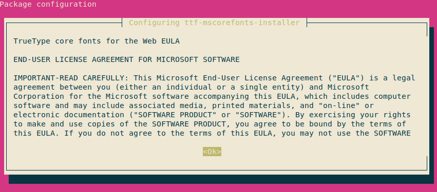
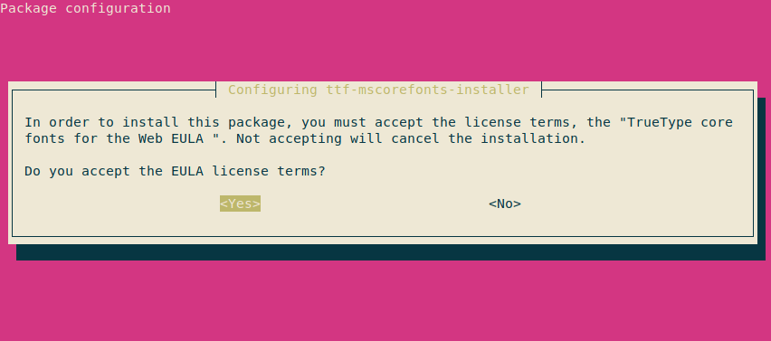
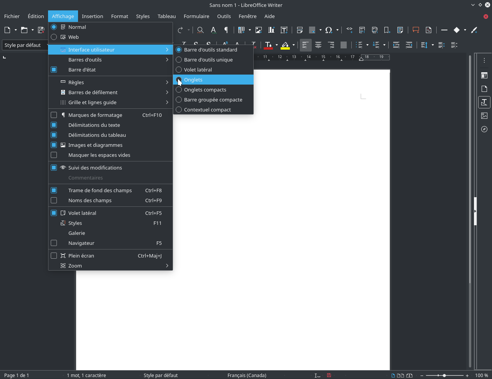

## Installer libreoffice
1. Ouvrer l'application _Konsole_.
2. Copier cette commande et coller dans l'application (ctrl-shift-v) _Konsole_ et appuyer sur la touche ENTER.

```bash
sudo add-apt-repository ppa:libreoffice/ppa -y && sudo pkcon refresh && sudo apt install libreoffice-kde5 libreoffice-writer libreoffice-impress libreoffice-calc mythes-fr libreoffice-l10n-fr libreoffice-help-fr
```

## Bon à savoir
Libreoffice peut lire et modifier les documents Word (.docx), mais il peut y avoir des problèmes de mise en page. Aussi, lors de l'impression il est préférable d'exporter en .pdf et d'imprimer le document avec le programme Okular plutôt que Libreoffice. Ensuite, l'équivalent à Word c'est Writer, à Excel c'est Calc et à PowerPoint c'est Impress.

## Installer Times New Roman et cie
1. Ouvrer l'application _Konsole_.
2. Copier cette commande et coller dans l'application (ctrl-shift-v) _Konsole_ et appuyer sur la touche ENTER.

```bash
sudo apt install ttf-mscorefonts-installer
```
3. Quand vous verrez les images ci-dessous, appuyer sur la touche ENTER pour accepter et TAB pour changer de choix.





## Adapter l'interface.
Pour adapter l'interface pour qu'elle ressemble à Word, il suffit de sélectionner le mode onglet dans le menu _Affichage_>_Interface utilisateur_ en haut de l'écran.



